## 프로메테우스 그라파나 모니터링 연습

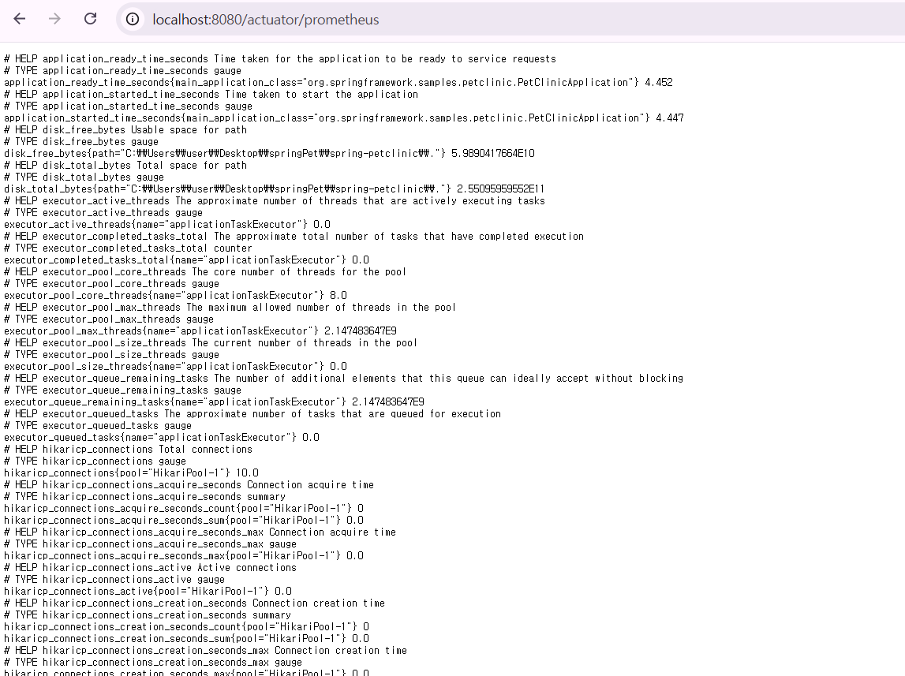

- 프로메테우스 매트릭 수집

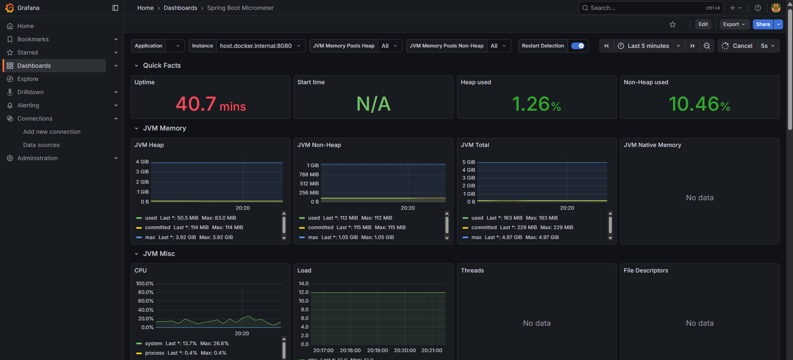

- 그라파나로 수집한 매트릭 시각화

## 트러블 슈팅 1. 트래픽 증대

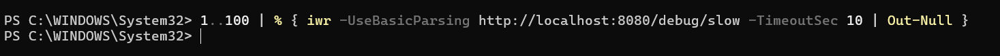

 - windows powerShell로 임의로 트래픽 증대

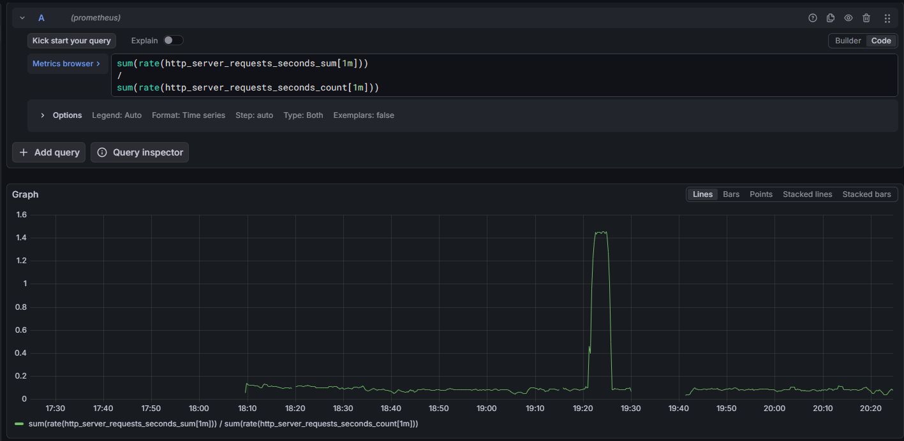

- 그라파나 Explore 쿼리로 확인 결과 19:20분경 트래픽과 지연시간이 증가된 것을 확인

## 생각해볼 수 있는것
 - cpu 문제
 - 특정 엔드포인트에서의 문제
 - DB 문제 시그널: DB 컨테이너 로그에서 대기/연결 문제가 보이거나, 특정 API에서만 지연이 커짐 
 - 앱 문제 시그널: CPU 상승, 스레드 증가, GC 증가 등 JVM 지표가 같이 흔들림

#### cpu 문제
process CPU vs system CPU
process CPU만 튐 → 내 앱(코드/GC) 쪽 가능성 ↑
system CPU도 같이 튐 → 다른 프로세스/호스트 리소스 문제 가능성 ↑

**CPU 튐과 함께 무엇이 같이 튀는가?**
응답시간(latency)↑ + RPS(요청량)↑ + CPU↑
→ 트래픽 과부하/스케일 문제 또는 핫패스 비효율

응답시간↑인데 CPU는 낮음
→ DB/네트워크 대기(= I/O 바운드) 가능성 ↑

GC pause↑ + CPU↑ + 힙 사용↑
→ 객체 과다 생성/메모리 압박/GC 문제 가능성 ↑

#### cpu 체크

process cpu 체크 19:20분경 이상 없음

system cpu 체크 19:20분경 이상 없음

결과: cpu 문제 말고 다른 문제 파악을 해야함
#### 특정 엔드포인트 체크

- 파악 하기 전 엔드 포인트 라벨 확인

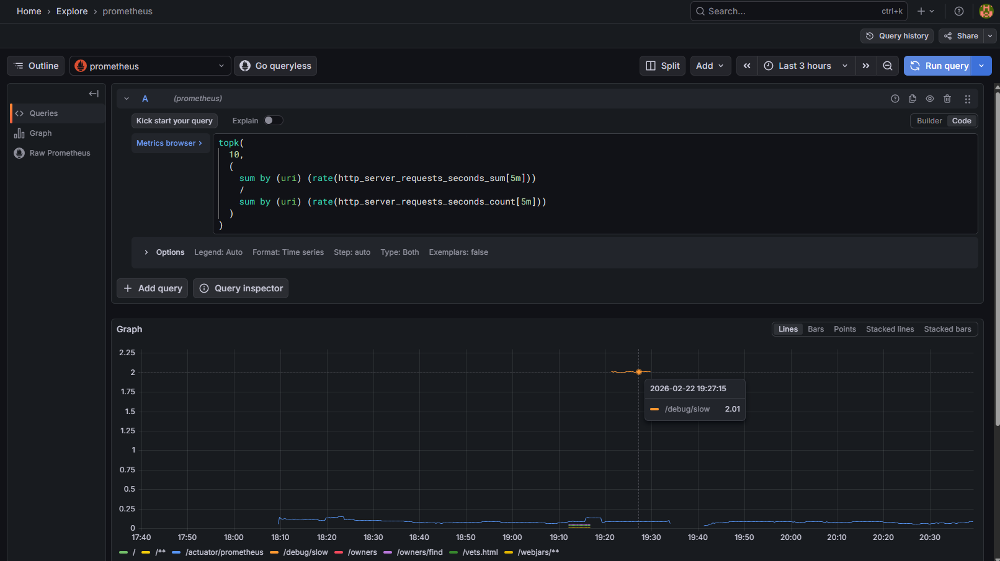

- 특정 엔드포인트에서 많은 요청이 일어나는 것을 확인

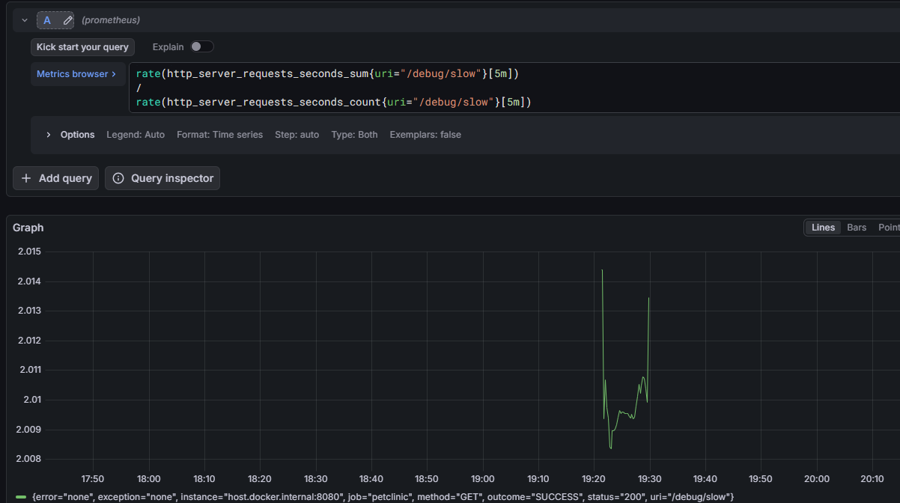

- 이것을 바탕으로 엔드포인트 쿼리를 보내 19:20분에 이상있는지 파악
- 이상이 있다는 것을 확인 후 코드 확인

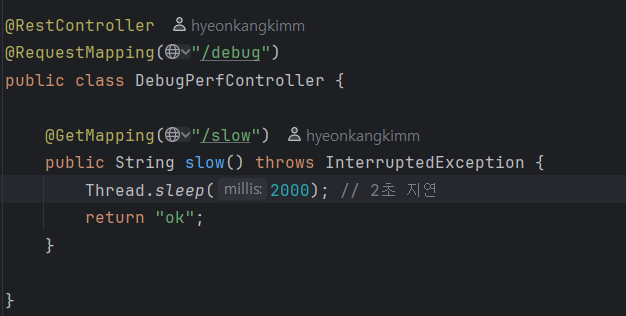

- 코드확인 결과 Thread.sleep(2000);때문에 지연이 일어난 것을 확인
- Thread.sleep(2000); 메서드 제거 
- 1차 트러블 슈팅 종료

---
## 트러블 슈팅 2. 데이터베이스 off

- 임의로 데이터베이스 OFF

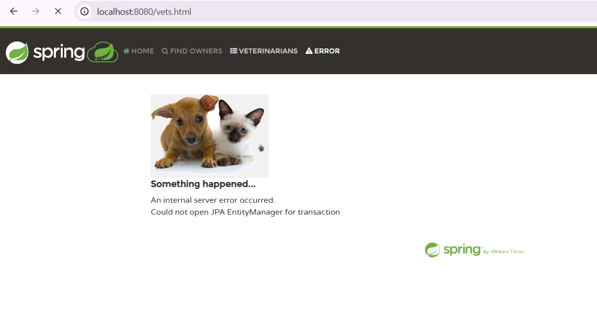
- VETERINARIANS 탭으로 들어가서 데이터 베이스 접속
- 데이터 베이스 접속이 안되어 Error 탭으로 가는것을 확인

#### Grafana info확인

 - 쿼리 status를 500대로 확인 해봤을때 17:50 분경 그래프가 튀는 것을 확인

- 특정 url에서 그래프가 튀는 것을 확인

- 앱로그 확인 문제 발견( Could not open JPA EntityManager for transaction)

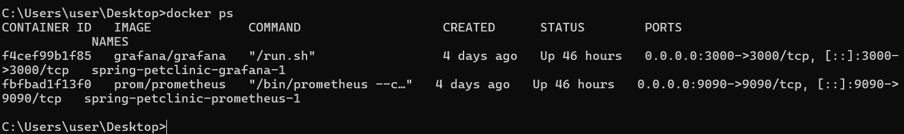
- 현재 docker에 올라와 있는 컨테이너 확인해 본 결과 postgresql이 올라와 있지 않다는 것을 확인

- postgresql을 컨테이너로 올린후 문제 재확인

- 정상적으로 해당 url에 들어가지는 것을 확인
- 2차 트러블 슈팅 종료

---
## 트러블 슈팅 3. 커넥션 풀 고갈

#### 초기 설정
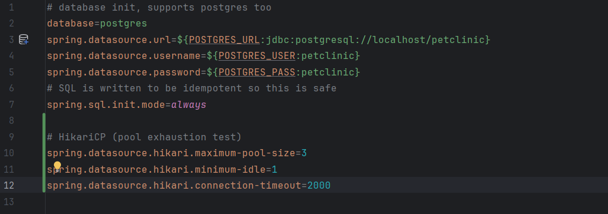
- hikariCP max pool을 의도적으로 작게 설정

- 의도적으로 커넥션을 붙잡을 컨트롤러 작성

#### 부하 걸기
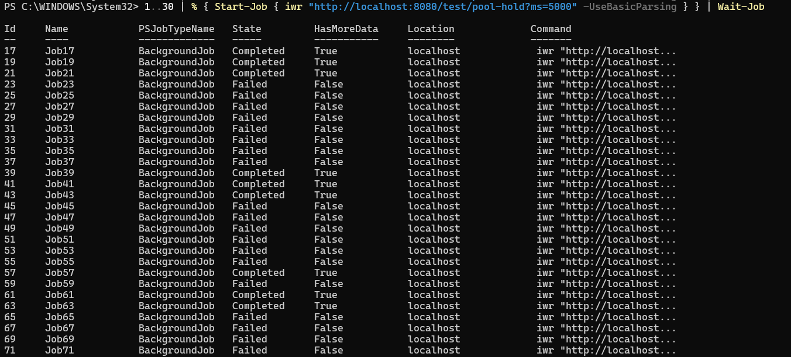
- powershell에서 해당 url로 부하를 직접 추가
- 결과를 확인하면 최대 hikari pool을 3으로 잡았기 때문에 커넥션을 놓아주었을때 비로소 true로 전환 되는 것을 볼 수 있음

#### grafana 확인

- 그라파나 500 에러 확인 쿼리 결과(요청 2번돌림) 다음과 같이 특정 시간에 500에러가 치솓는것을 볼 수 있음

- 95 퍼센타일(느림 정도 지표) 
- 최근 1분 동안 각 버킷 카운트가 초당 얼마나 늘었는지 확인

퍼센타일이 높아지면 생길 수 있는 일
1) 커넥션 풀 고갈/대기
DB 커넥션이 부족해서 요청들이 커넥션 기다리느라 지연
특징:
hikaricp_connections_active가 max에 붙음
hikaricp_connections_pending 증가
동시에 5xx(특히 timeout)도 같이 늘 수 있음

2) DB 쿼리 자체가 느려짐(인덱스/풀스캔/락)
요청은 커넥션을 잘 빌렸는데, 쿼리가 오래 걸려서 응답이 느려짐
특징:
active는 높을 수 있어도 pending은 크게 안 오를 수도
DB CPU/IO 상승, slow query 로그에 찍힘

3) 락(lock) 경합
어떤 트랜잭션이 row/table을 잡고 있어서 다른 쿼리가 기다림
특징:
특정 API만 p95 급등
DB에서 waiting/blocked 쿼리 증가

4) 외부 API 호출 지연
DB가 아니라 외부 서버가 느려져서 응답이 늦어짐
특징:
DB/히카리 지표는 멀쩡한데 p95만 뜀
외부 호출 타이머/로그가 길어짐

5) 앱 리소스 문제(스레드풀 포화, GC, CPU)
스레드가 부족하거나 GC가 길게 멈추거나 CPU가 꽉 차서 처리 지연
특징:
모든 URI에서 p95가 같이 오르는 편
JVM/서버 리소스 지표랑 같이 튐

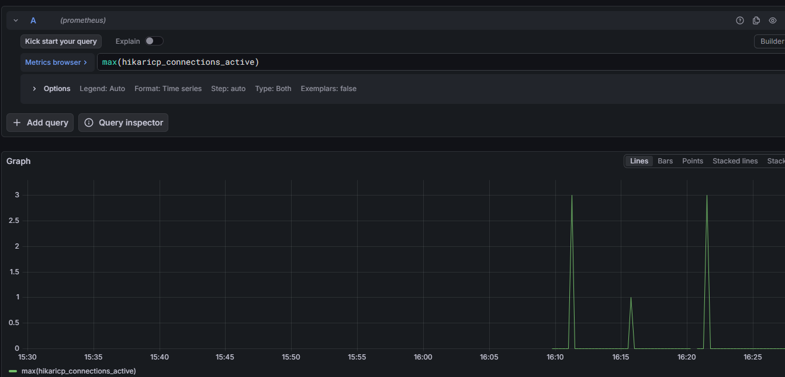
- hikari pool이 active 가 몇인지 확인 - active상태인 풀이 3개인 것을 확인

- 대기중인 pool이 몇개인지 확인 (pending) 대기중인 pool이 5개가 넘어가는 것을 확인 해 볼 수 있음

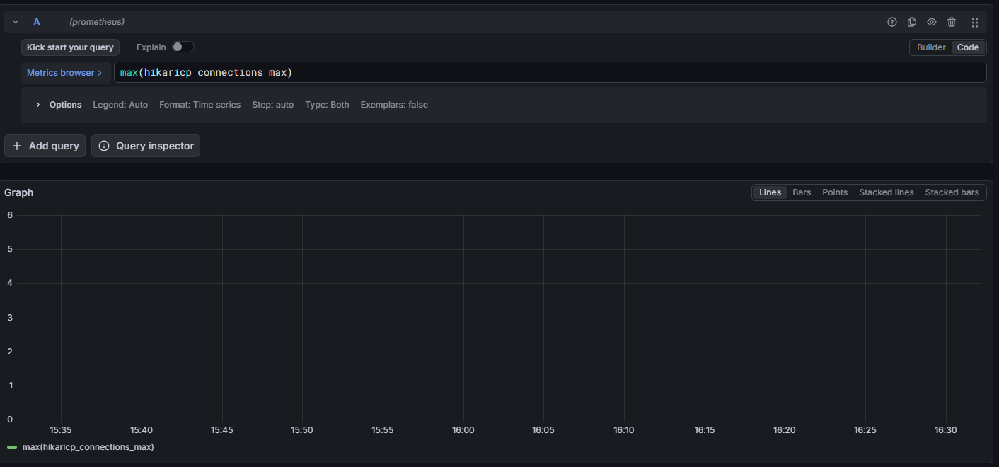
- 마지막으로 max pool을 확인- 최대 3개인 것을 확인(비정상적)

- 마지막으로 앱 로그 확인  
- ERROR =>HikariPool-1 - Connection is not available, request timed out after 2011ms (total=3, active=3, idle=0, waiting=0)

#### 결론
- HikariPool의 max풀 개수와 요청이 안맞아서 timeOut이 발생했다고 확인 할 수 있다.

#### 해결방안
HikariCP 커넥션 풀 고갈(Connection Pool Exhaustion)
#### 원인 요약
    애플리케이션은 DB 작업 시 HikariCP 커넥션 풀에서 커넥션을 “대여”해 사용한다.
    동시 요청 증가 또는 커넥션 점유 시간이 길어지면(active == max) 풀에서 커넥션을 더 이상 빌릴 수 없어 pending이 증가한다.
    대기 시간이 connectionTimeout을 초과하면 커넥션 대여 실패가 발생하고, 결과적으로 API가 500/timeout으로 실패한다.
    본 이슈는 DB 자체가 다운되지 않아도 발생하며, “DB 장애”가 아니라 “애플리케이션 커넥션 풀 자원 부족” 문제다.

#### 애플리케이션(코드/트랜잭션) 개선
    2-1. 트랜잭션 범위 최소화
    @Transactional 구간을 DB 작업에만 한정한다.
    트랜잭션 안에서 다음 작업을 수행하지 않도록 구조를 변경한다:
    외부 API 호출, 파일 업로드, 긴 연산/루프, sleep 등
    효과: 커넥션 점유 시간 감소 → active 지속 시간 단축 → pending 및 timeout 감소

    2-2. 쿼리 수/속도 최적화(N+1 및 느린 쿼리 제거)    
    N+1이 발생하는 조회 로직은 fetch join, EntityGraph, DTO projection 등으로 개선한다.
    인덱스 점검 및 느린 쿼리 튜닝을 수행한다.
    효과: 단일 요청이 커넥션을 오래 점유하는 시간을 줄여 풀 고갈 위험을 낮춤
    2-3. 커넥션 누수(반납 누락) 방지
    커넥션 반환 누락 가능성을 감시하기 위해 Hikari leak detection을 활성화한다.
    예: spring.datasource.hikari.leak-detection-threshold=5000
    효과: 코드에서 커넥션이 장시간 반환되지 않는 위치를 로그로 추적 가능

#### HikariCP 설정(튜닝) 개선 
    3-1. pool size 튜닝 원칙
    무작정 maximumPoolSize를 키우는 방식은 멀티 인스턴스 환경에서 DB 연결 폭증을 유발할 수 있으므로 위험하다.
    "DB가 감당 가능한 총 연결 수”를 기준으로 인스턴스당 풀 사이즈를 산정한다.
    총 연결 수 ≈ (애플리케이션 인스턴스 수 × maximumPoolSize)
    3-2. 빠른 실패(Fail-Fast) 설정
    커넥션이 부족할 때 요청이 무한 대기하며 적체되는 것을 막기 위해 connectionTimeout을 짧게 유지한다(예: 1~3초).
    효과: 장애 시 빠르게 감지 및 확산 방지, 대기열 폭증 완화

#### 클라우드(RDS) 환경에서의 운영 개선
    4-1. 멀티 인스턴스 환경의 핵심 리스크
    오토스케일/다중 인스턴스 운영 시, 인스턴스 수가 늘어날수록 DB로 향하는 총 커넥션 수가 선형 증가한다.
    DB의 max_connections 한계를 초과하면 DB 전체가 불안정해질 수 있다.
    4-2. RDS Proxy(또는 PgBouncer) 도입
    앱과 RDS 사이에 RDS Proxy(Postgres면 PgBouncer도 가능)를 두어 커넥션 재사용 및 관리 계층을 추가한다.
    효과:
    인스턴스 증가 시 DB 커넥션 폭증 완화
    커넥션 생성 비용 감소로 지연 감소
    스파이크 트래픽에서 안정성 강화
    4-3. 모니터링/알람 구축
    다음 지표를 기반으로 Grafana/CloudWatch 알람을 설정한다:
    hikaricp_connections_active가 max 근접 상태로 지속
    hikaricp_connections_pending 발생/지속
    HTTP 5xx 증가 및 응답 지연(p95/p99) 상승
    RDS connections/CPU/IOPS/latency 상승, slow query 증가
    효과: “DB 다운”과 “풀 고갈”을 빠르게 구분하고 선제 대응 가능

#### 기대 효과
    트랜잭션/쿼리 최적화를 통해 커넥션 점유 시간을 줄여 풀 고갈 가능성을 낮춘다.
    인스턴스 확장 환경에서도 총 커넥션 수를 통제하고(RDS Proxy 등) DB 불안정을 예방한다.
    모니터링 및 알람으로 장애 징후를 조기에 감지하고, 장애 원인을 명확히 분류할 수 있다.

---
## 트러블 슈팅 4. 메모리 누수

#### 고의적으로 참조하는 객체 만들기
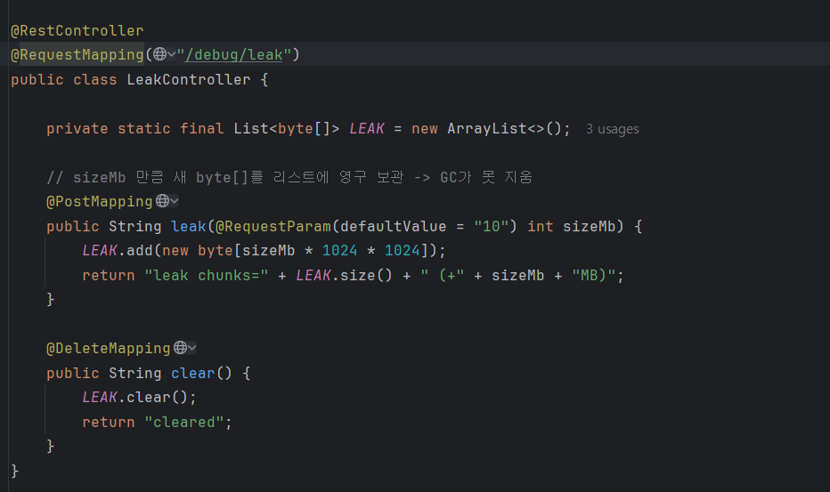
- 다음과 같이 코드를 짜면 발생 할 수 있는 일
- GC(가비지 컬렉터)가 원래는 참조하고 있지 않은 메모리를 지워주어야하는데 ,
- 이렇게 되면 URL을 호출 할 때마다 큰 메모리가 쌓임과 동시에 Leak배열이 참조를 하기때문에 메모리가 정리되지 않고 쌓인다.

#### 트러블 슈팅 시작
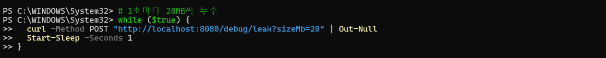
- 고의적으로 만들어 놓은 URL에 요청을 지속적으로 보냄
- 기대효과: 요청을 할때마다 큰 메모리가 힙에 생성되고 이것을 LEAK이 참조를 바로 하기때문에 GC가 동작 안함

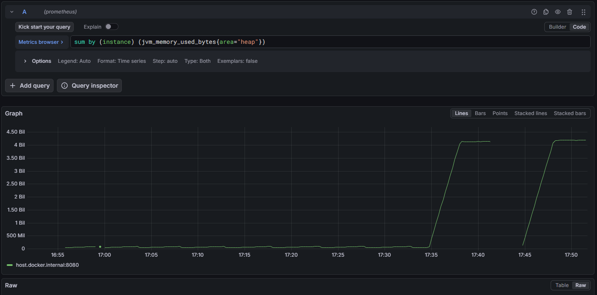
- 그라파나로 힙 사용량 체크 특정 시간에(스크립트 돌린 시간) 크게 힙 그래프가 올라가는 것을 확인 할 수 있음

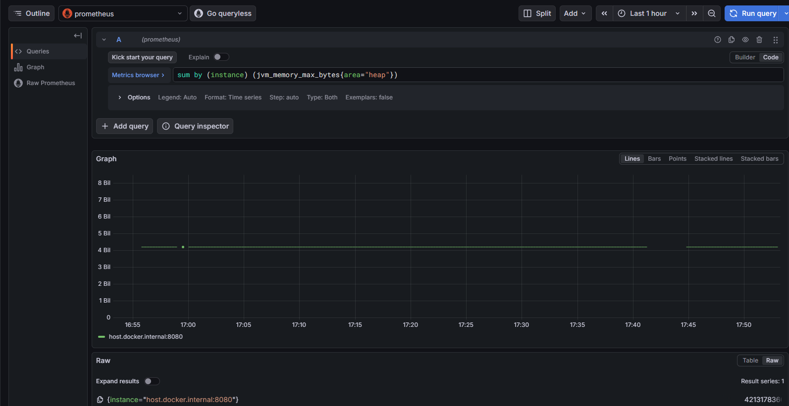
- 그라파나로 서버의 최대 힙을 확인 한 결과
- 사용량 체크과 최대 힙을 조합해본 결과 힙을 최대로 사용하고 있다는 결과 도출

#### 해결방안
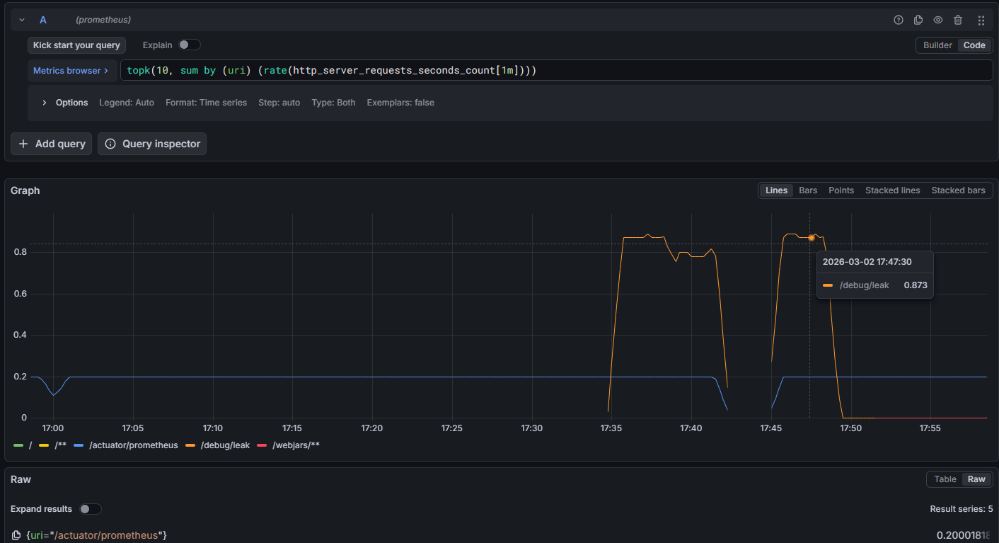
- 어떤 특정 url이 힙이 증가한 시간에 요청이 많이 되었는지 파악
- "/debug/leak" 확인 

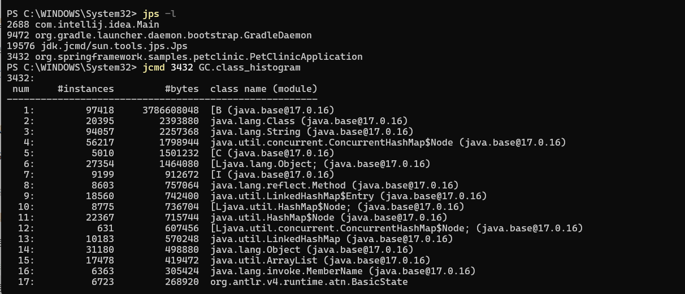
- PID먼저 확인 후 대량누수인지 GC가 돌지 않는 문제인지 파악

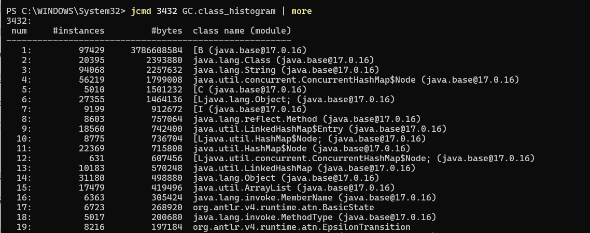
- 힙을 잡아먹고 있는게 BYTE배열인 것을 확인
- 추가로 현재 URL을 요청하지 않았음에도 힙을 잡아먹고 있다는 것을 미루어 보아 GC문제인것으로 특정 할 수 있음

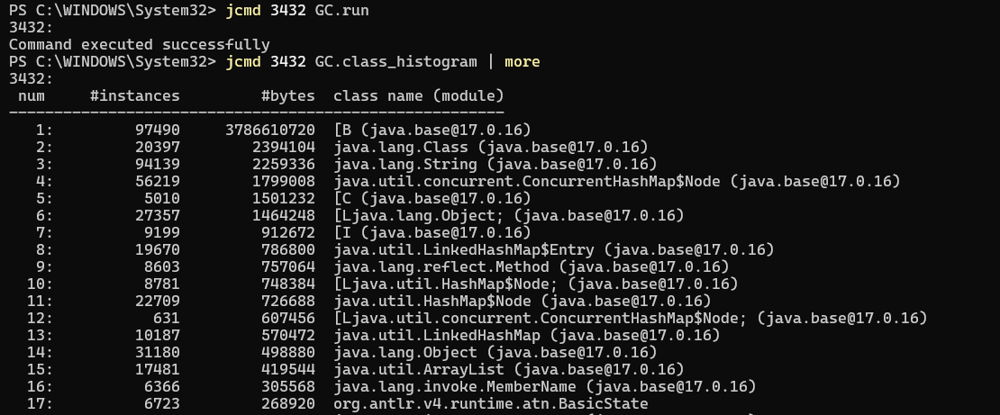
- 강제로 GC를 돌려도 BYTE가 남아있는것으로 보아 확정 할 수 있음

#### 코드 확인
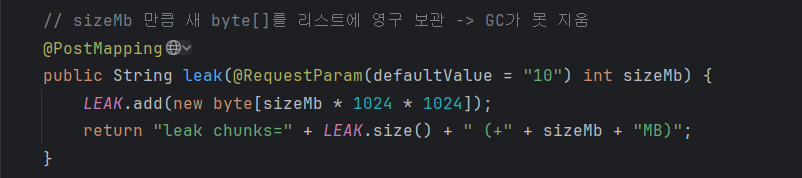
- **문제발견** 다음 코드에서 문제점을 발견 LEAK이 무한 참조를 하고있음

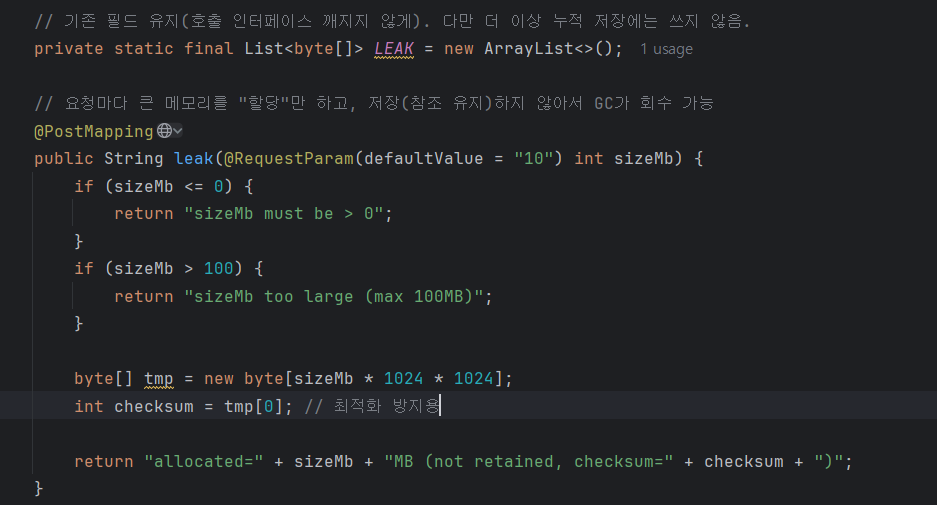
- 코드 수정

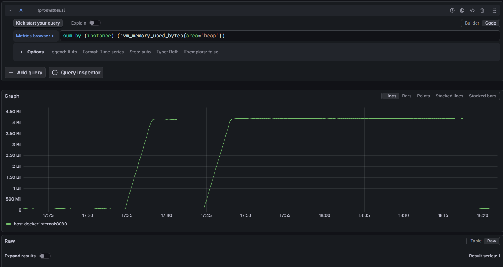
- 그라파나 재확인 현재시각 18:21분 힙이 정상적으로 내려간 것을 확인

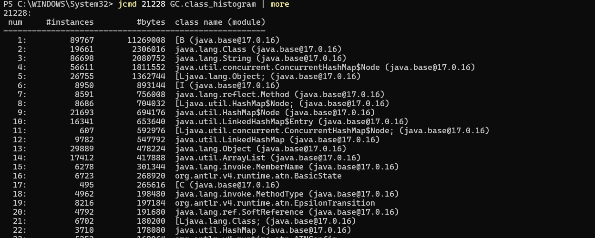
- 스크립트로 확인 결과 BYTE가 10MB 수준으로 내려간 것을 확인

#### 트러블슈팅 종료

---
## 트러블슈팅 5. 외부 api 호출 지연

### 초기 세팅
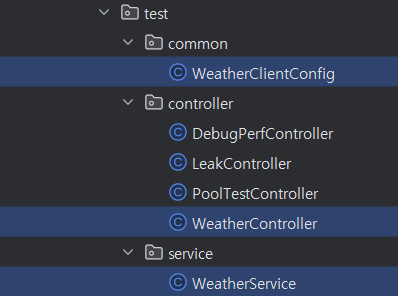
 - weather에 관련된 api 호출 Service , Controller , Config 추가

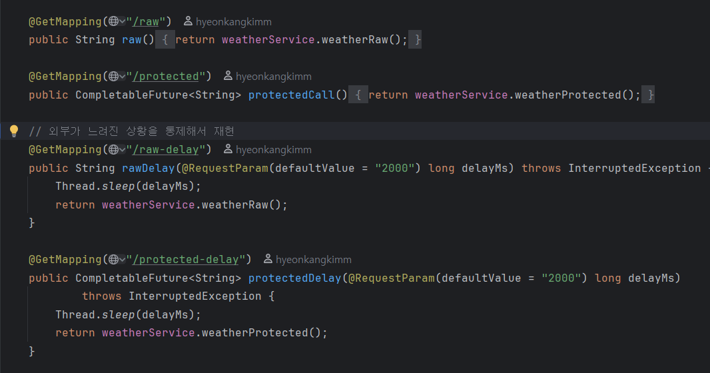
- 컨트롤러에서는 정상처리와 비정상 처리를 하여 에러를 표현
  - **/debug/weather/raw**
  - 기본 외부 호출(OpenWeatherMap을 그대로 호출해서 결과를 반환)
  -  **/debug/weather/raw-delay?delayMs=2000**
  -  컨트롤러에서 /debug/weather/raw-delay?delayMs=2000 으로 임의로 느려지게 조작
  - **/debug/weather/protected**
  - 외부 호출 + 보호 적용(Timeout/서킷브레이커/fallback)
  - 외부 장애가 있어도 우리 API가 오래 붙잡히지 않게 하기
  - **/debug/weather/protected-delay?delayMs=2000**
  - 외부가 느려졌다고 가정(지연 주입) + 보호 적용

**raw = 외부 호출 기본**

**raw-delay = 외부 지연 상황을 만들어서 “문제(지연 전파)”를  보여줌**

**protected = 방어 적용 버전(해결 버전)**

**protected-delay = 지연 상황에서도 방어가 “전파 차단”하는지 검증(딜레이가 있는 상태에서 해결 방안)**

### 트러블 슈팅 시작
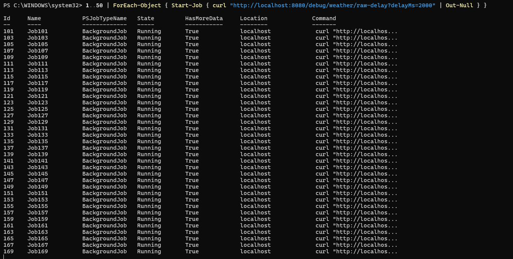
- /debug/weather/raw-delay?delayMs=2000에 부하 걸기
- 기대효과 : 기대: 응답이 2초 이상 걸림(외부 호출 지연이 그대로 전파)

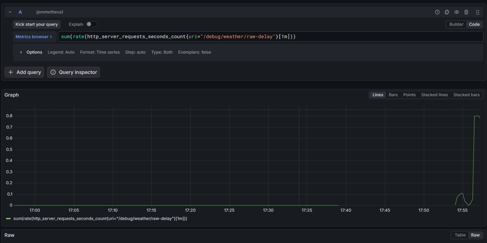
- 그라파나로 해당 url의 요청량 확인

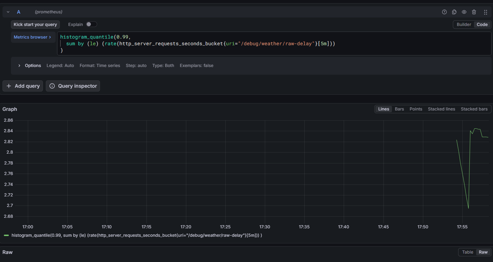
- P99(지연구간 지표)를 확인해보면 해당 url에 2초정도 지연이 발생하는것을 확인 할 수있음
- 여기서 만들 수 있는 가설
- 1.api문제 2.cpu문제 3.db문제
- CPU 문제면 process/system cpu가 같이 튐
- DB 문제면 hikari pending/timeout, DB 에러 로그가 같이 튐
- 외부 API 문제면:
특정 URI만 p99 급증
CPU/DB/Hikari는 상대적으로 안정
로그에서 외부 호출 timeout/지연/실패가 보임

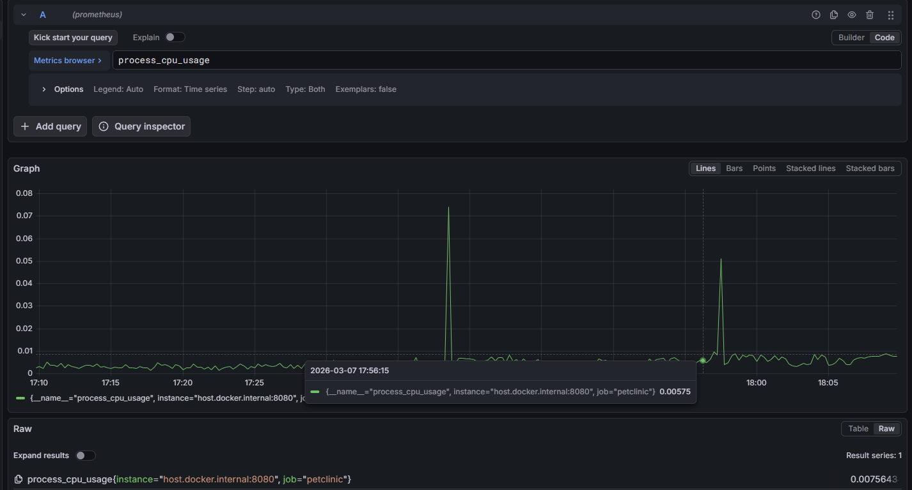
- 그라파나 Explore 쿼리 확인 결과 56분에 튈때 프로세스는 튀지 않는 것을 확인
- cpu 제외

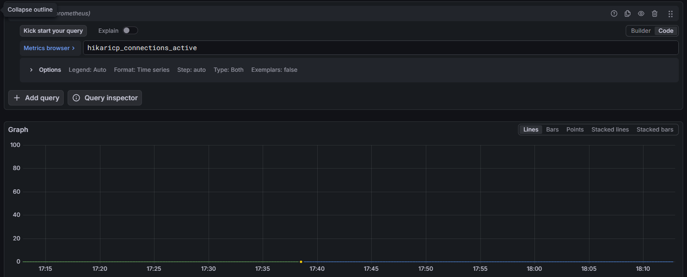
- HikariCP Pool도 튀지 않은 것을 확인
- 풀고갈 , db커넥션 문제도 아닌것을 확인 제외

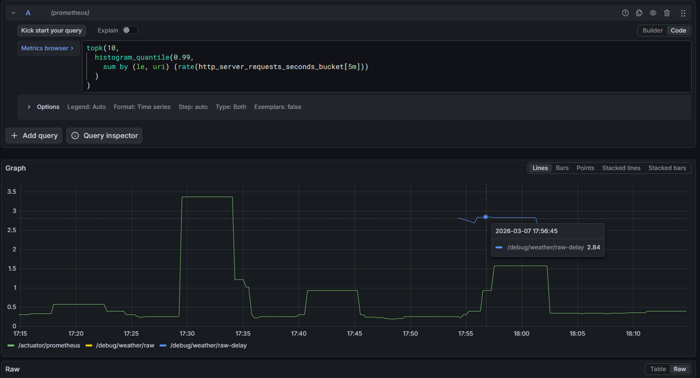
- 특정 url의 요청일 때만 튀는 것을 확인
- api 요청 딜레이 확인 필요

### 해결 방안
**기존에 만들어두었던 protected api사용(안만들었다면 만들어야함)**
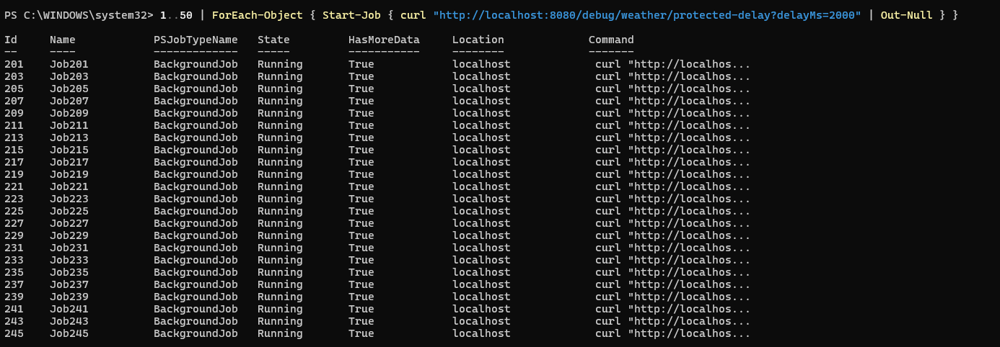
- 딜레이가 걸리는 상황에서 만들어두었던 timeout정책을 사용하여 시간이 오래 걸릴시 최대 1초 정책이 들어간 protected api사용

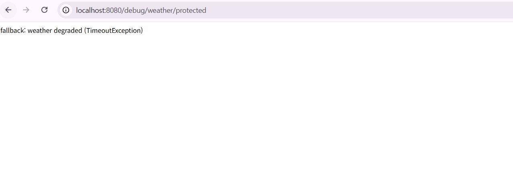
- 타임아웃 정책이 들어간 url은 다음과 같은 오류를 내보냄

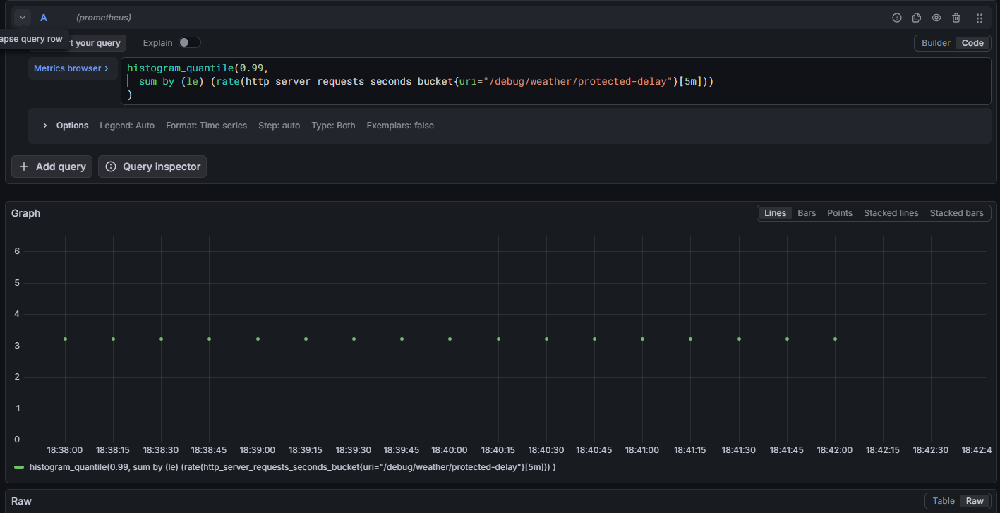
- timeOut을 걸어놓았기때문에 일정 시간이 지나면 제한이 걸린다는 것을 확인 가능하다.

#### 반면 
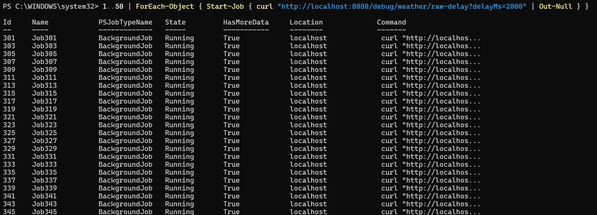
- 다음과 같이 기존 딜레이 즉 타임아웃 제한을 걸어두지 않았다면

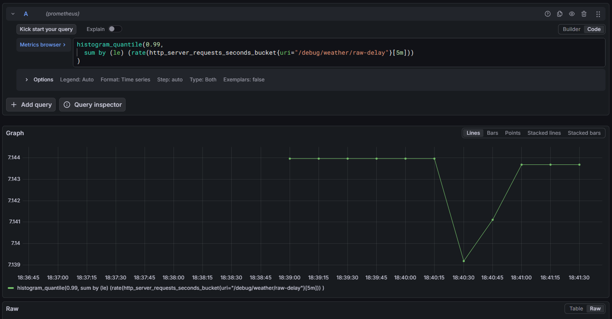
- y축 그래프가 몹시 올라가는 것을 볼 수 있음

따라서 api 요청을 하는 로직을 작성한다면 이러한 타임아웃을 꼭 걸어주어야함

**트러블 슈팅 종료**

---

## 트러블 슈팅 5. N+1문제

#### N+1 문제는 무엇인가?
- 연관 데이터를 조회하는 과정에서 1번의 기본 조회 후, 조회된 N개의 데이터마다 추가 쿼리가 반복 실행되는 ORM 성능 문제
- 데이터 개수 N에 비례해 불필요한 쿼리가 증가하는 성능 저하 현상
### 초기세팅
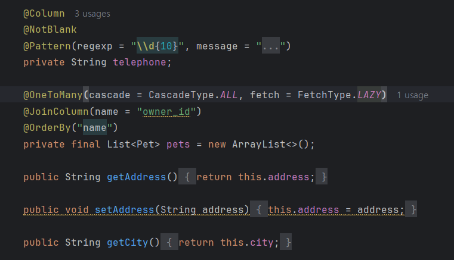
- Owner 엔티티 칼럼의 FetchType을 EAGER에서 LAZY로 수정

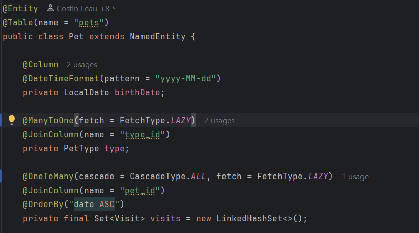
- Pet 엔티티 칼럼의 FetchType을 EAGER에서 LAZY로 수정

- ownerRepository.findAll()은 owner만 먼저 가져오고
이후 코드에서 owner.getPets()에 접근할 때 owner마다 추가 조회가 발생

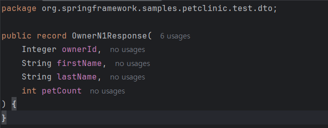
- 조회용 Dto 생성

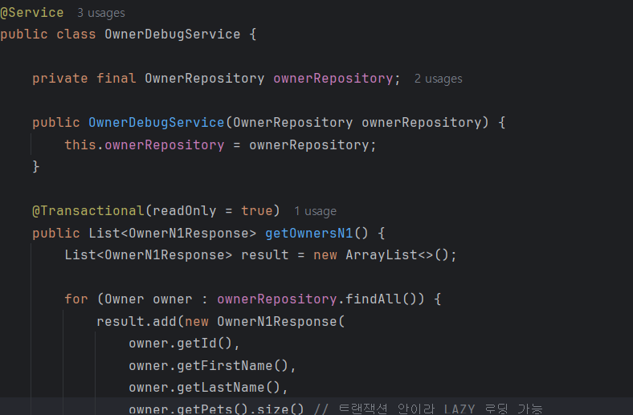
- 조회용 서비스 생성
- get요청을 위한 트랜잭션 readOnly 어노테이션을 붙여서 lazy로딩

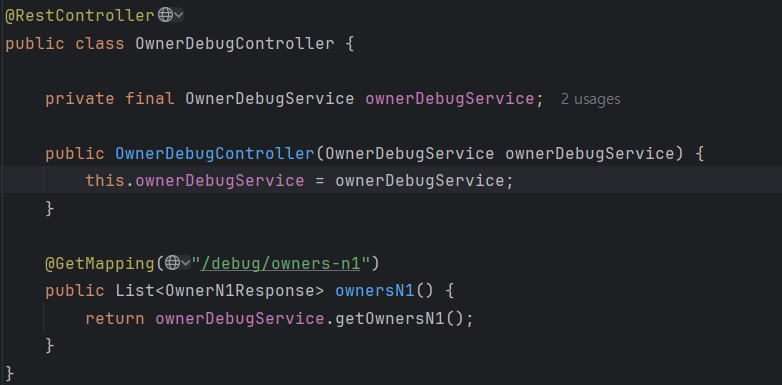
- 서비스 호출 컨트롤러 생성

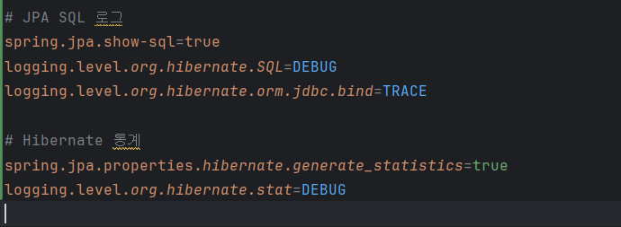
- n+1문제를 관찰하기위한 로그 properties 설정 추가

#### 데이터 넣기
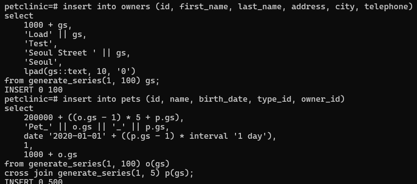
owners , 각 owner마다 pet 데이터 삽입

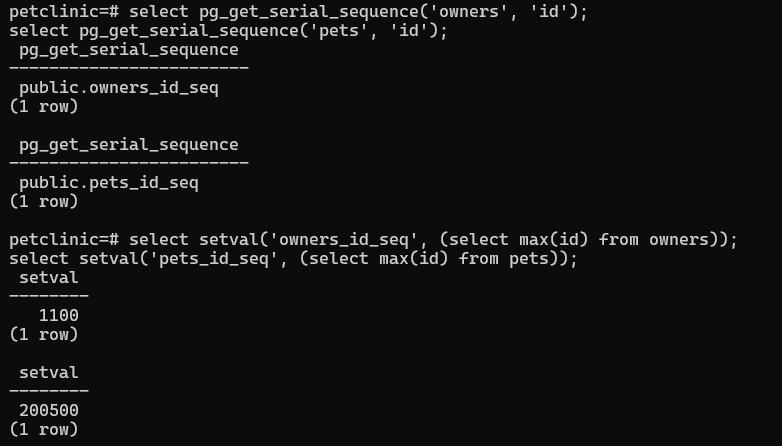
수동 삽입으로 인한 시퀀스 맞추기 작업

#### 트러블 슈팅 시작

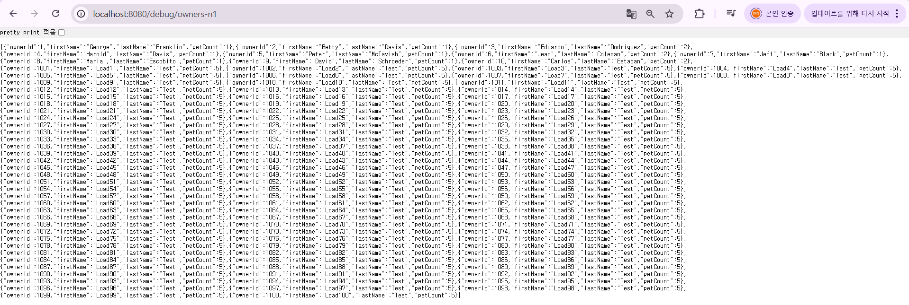
- 단건조회 결과 정상작동 하는 것을 확인 할 수 있음

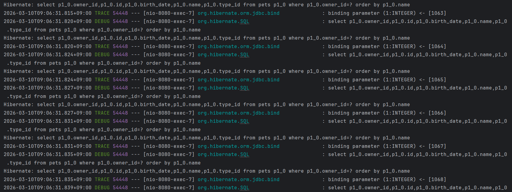
- 설정해두었던 로그를 확인해보면 n+1 문제가 생긴다는 것을 확인 할 수 있음
- 지금은 단건 조회라 n+1문제가 체감이 안되지만 트래픽이 많이 몰리면 어떻게 되는지 확인

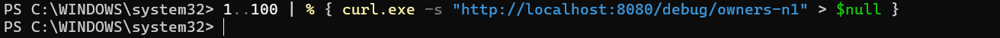
 - 부하 스크립트 사용

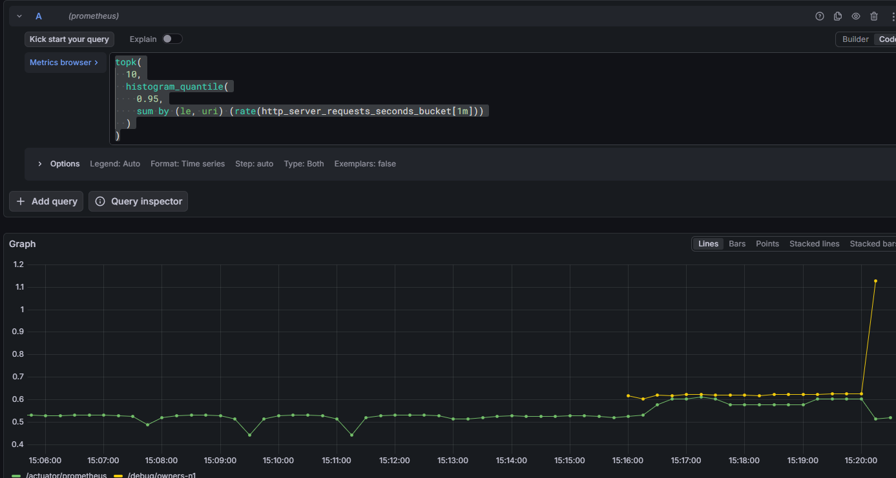
- 응답시간지연이 큰 특정 url을 확인
- 비정상적으로 하나의 특정 url(노란색)이 치솓는것을 볼 수 있음
- 문제상황인지


- 이 요청이 단순히 요청이 늘어나서 응답 지연이 늘어난 것인지 확인
- 문제 발견 테스트 하는 과정에서 하나의 url에만 부하를 걸었기때문에 
- 이것이 정말 n+1문제인지 판별 불가

- 따라서 다른 url에도 스크립트를 걸어주어 더 큰 부하가 생기는지 테스트해야함


- 3개의 get요청에 같은 부하를 걸어주어 비교하며 테스트 진행


- 그라파나에서 같은 쿼리를 돌려 확인 일단 부하가 많이 걸린 것을 확인 할 수 있다.


- 다음과 같이 파란색 그래프 즉 우리가 만들었던 n+1 로직이
- 다른 url보다 y축 그래프가 0.7 정도로 월등히 높은것을 확인 할 수있음
- 문제상황인지


- 이러한 요청 지연이 서버에러때문인지 확인해보기위해 쿼리를 돌려본 결과
- 서버 에러는 아닌것을 확인

#### 코드분석

- 서비스 코드를 확인해보니 findAll()을 통해 n+1문제가 일어나는 것을 확인

### 해결방안

- 리포지토리 코드를 jpa에서 제공하는 findAll()메서드가 아닌 fetchJoin메서드 추가


- 서비스 코드에서 이 메서드를 사용하도록 수정


- 컨트롤러 수정

fetchJoin말고 @EntityGraph 사용해도 무방하다.

#### 성능 테스트


- 같은 부하를 걸어준다.


- 부하 확인


- 특정 url의 응답지연 p95 쿼리를 확인해보니...

### n+1문제를 해결하면서 해당 url의 부하가 크게 준 것을 확인 할 수 있다.

트러블 슈팅 완료. 
