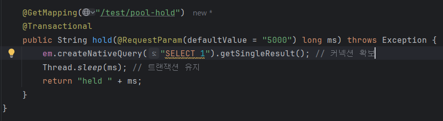
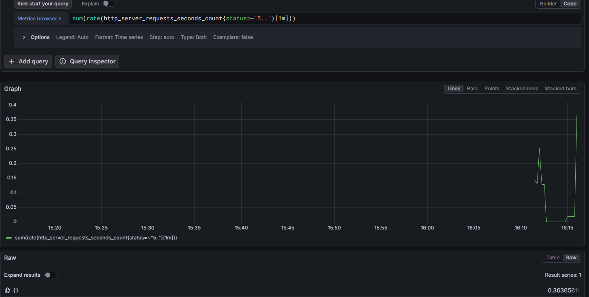
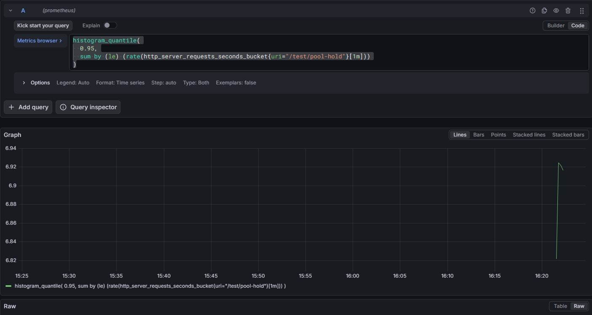
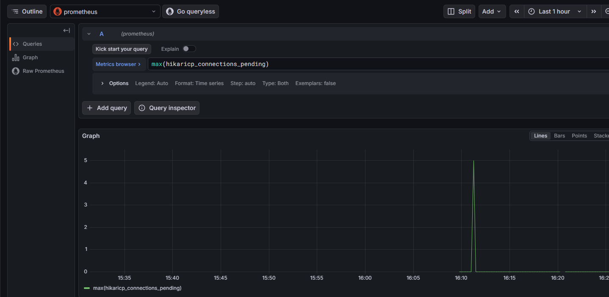
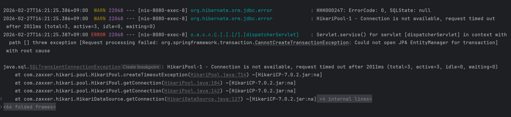

## 프로메테우스 그라파나 모니터링 연습

- 프로메테우스 매트릭 수집

- 그라파나로 수집한 매트릭 시각화

## 트러블 슈팅 1. 트래픽 증대

 - windows powerShell로 임의로 트래픽 증대

- 그라파나 Explore 쿼리로 확인 결과 19:20분경 트래픽과 지연시간이 증가된 것을 확인

## 생각해볼 수 있는것
 - cpu 문제
 - 특정 엔드포인트에서의 문제
 - DB 문제 시그널: DB 컨테이너 로그에서 대기/연결 문제가 보이거나, 특정 API에서만 지연이 커짐 
 - 앱 문제 시그널: CPU 상승, 스레드 증가, GC 증가 등 JVM 지표가 같이 흔들림

#### cpu 문제
process CPU vs system CPU
process CPU만 튐 → 내 앱(코드/GC) 쪽 가능성 ↑
system CPU도 같이 튐 → 다른 프로세스/호스트 리소스 문제 가능성 ↑

**CPU 튐과 함께 무엇이 같이 튀는가?**
응답시간(latency)↑ + RPS(요청량)↑ + CPU↑
→ 트래픽 과부하/스케일 문제 또는 핫패스 비효율

응답시간↑인데 CPU는 낮음
→ DB/네트워크 대기(= I/O 바운드) 가능성 ↑

GC pause↑ + CPU↑ + 힙 사용↑
→ 객체 과다 생성/메모리 압박/GC 문제 가능성 ↑

#### cpu 체크

process cpu 체크 19:20분경 이상 없음

system cpu 체크 19:20분경 이상 없음

결과: cpu 문제 말고 다른 문제 파악을 해야함
#### 특정 엔드포인트 체크

- 파악 하기 전 엔드 포인트 라벨 확인

- 특정 엔드포인트에서 많은 요청이 일어나는 것을 확인

- 이것을 바탕으로 엔드포인트 쿼리를 보내 19:20분에 이상있는지 파악
- 이상이 있다는 것을 확인 후 코드 확인

- 코드확인 결과 Thread.sleep(2000);때문에 지연이 일어난 것을 확인
- Thread.sleep(2000); 메서드 제거 
- 1차 트러블 슈팅 종료

---
## 트러블 슈팅 2. 데이터베이스 off

- 임의로 데이터베이스 OFF

- VETERINARIANS 탭으로 들어가서 데이터 베이스 접속
- 데이터 베이스 접속이 안되어 Error 탭으로 가는것을 확인

#### Grafana info확인

 - 쿼리 status를 500대로 확인 해봤을때 17:50 분경 그래프가 튀는 것을 확인

- 특정 url에서 그래프가 튀는 것을 확인

- 앱로그 확인 문제 발견( Could not open JPA EntityManager for transaction)

- 현재 docker에 올라와 있는 컨테이너 확인해 본 결과 postgresql이 올라와 있지 않다는 것을 확인

- postgresql을 컨테이너로 올린후 문제 재확인

- 정상적으로 해당 url에 들어가지는 것을 확인
- 2차 트러블 슈팅 종료

---
## 트러블 슈팅 3. 커넥션 풀 고갈

#### 초기 설정

- hikariCP max pool을 의도적으로 작게 설정

- 의도적으로 커넥션을 붙잡을 컨트롤러 작성

#### 부하 걸기

- powershell에서 해당 url로 부하를 직접 추가
- 결과를 확인하면 최대 hikari pool을 3으로 잡았기 때문에 커넥션을 놓아주었을때 비로소 true로 전환 되는 것을 볼 수 있음

#### grafana 확인

- 그라파나 500 에러 확인 쿼리 결과(요청 2번돌림) 다음과 같이 특정 시간에 500에러가 치솓는것을 볼 수 있음

- 95 퍼센타일(느림 정도 지표) 
- 최근 1분 동안 각 버킷 카운트가 초당 얼마나 늘었는지 확인

퍼센타일이 높아지면 생길 수 있는 일
1) 커넥션 풀 고갈/대기
DB 커넥션이 부족해서 요청들이 커넥션 기다리느라 지연
특징:
hikaricp_connections_active가 max에 붙음
hikaricp_connections_pending 증가
동시에 5xx(특히 timeout)도 같이 늘 수 있음

2) DB 쿼리 자체가 느려짐(인덱스/풀스캔/락)
요청은 커넥션을 잘 빌렸는데, 쿼리가 오래 걸려서 응답이 느려짐
특징:
active는 높을 수 있어도 pending은 크게 안 오를 수도
DB CPU/IO 상승, slow query 로그에 찍힘

3) 락(lock) 경합
어떤 트랜잭션이 row/table을 잡고 있어서 다른 쿼리가 기다림
특징:
특정 API만 p95 급등
DB에서 waiting/blocked 쿼리 증가

4) 외부 API 호출 지연
DB가 아니라 외부 서버가 느려져서 응답이 늦어짐
특징:
DB/히카리 지표는 멀쩡한데 p95만 뜀
외부 호출 타이머/로그가 길어짐

5) 앱 리소스 문제(스레드풀 포화, GC, CPU)
스레드가 부족하거나 GC가 길게 멈추거나 CPU가 꽉 차서 처리 지연
특징:
모든 URI에서 p95가 같이 오르는 편
JVM/서버 리소스 지표랑 같이 튐

- hikari pool이 active 가 몇인지 확인 - active상태인 풀이 3개인 것을 확인

- 대기중인 pool이 몇개인지 확인 (pending) 대기중인 pool이 5개가 넘어가는 것을 확인 해 볼 수 있음

- 마지막으로 max pool을 확인- 최대 3개인 것을 확인(비정상적)

- 마지막으로 앱 로그 확인  
- ERROR =>HikariPool-1 - Connection is not available, request timed out after 2011ms (total=3, active=3, idle=0, waiting=0)

#### 결론
- HikariPool의 max풀 개수와 요청이 안맞아서 timeOut이 발생했다고 확인 할 수 있다.

#### 해결방안

HikariCP 커넥션 풀 고갈(Connection Pool Exhaustion)
1) 원인 요약
애플리케이션은 DB 작업 시 HikariCP 커넥션 풀에서 커넥션을 “대여”해 사용한다.
동시 요청 증가 또는 커넥션 점유 시간이 길어지면(active == max) 풀에서 커넥션을 더 이상 빌릴 수 없어 pending이 증가한다.
대기 시간이 connectionTimeout을 초과하면 커넥션 대여 실패가 발생하고, 결과적으로 API가 500/timeout으로 실패한다.
본 이슈는 DB 자체가 다운되지 않아도 발생하며, “DB 장애”가 아니라 “애플리케이션 커넥션 풀 자원 부족” 문제다.

2) 애플리케이션(코드/트랜잭션) 개선
2-1. 트랜잭션 범위 최소화
@Transactional 구간을 DB 작업에만 한정한다.
트랜잭션 안에서 다음 작업을 수행하지 않도록 구조를 변경한다:
외부 API 호출, 파일 업로드, 긴 연산/루프, sleep 등
효과: 커넥션 점유 시간 감소 → active 지속 시간 단축 → pending 및 timeout 감소

2-2. 쿼리 수/속도 최적화(N+1 및 느린 쿼리 제거)
N+1이 발생하는 조회 로직은 fetch join, EntityGraph, DTO projection 등으로 개선한다.
인덱스 점검 및 느린 쿼리 튜닝을 수행한다.
효과: 단일 요청이 커넥션을 오래 점유하는 시간을 줄여 풀 고갈 위험을 낮춤
2-3. 커넥션 누수(반납 누락) 방지
커넥션 반환 누락 가능성을 감시하기 위해 Hikari leak detection을 활성화한다.
예: spring.datasource.hikari.leak-detection-threshold=5000
효과: 코드에서 커넥션이 장시간 반환되지 않는 위치를 로그로 추적 가능

3) HikariCP 설정(튜닝) 개선 
3-1. pool size 튜닝 원칙
무작정 maximumPoolSize를 키우는 방식은 멀티 인스턴스 환경에서 DB 연결 폭증을 유발할 수 있으므로 위험하다.
“DB가 감당 가능한 총 연결 수”를 기준으로 인스턴스당 풀 사이즈를 산정한다.
총 연결 수 ≈ (애플리케이션 인스턴스 수 × maximumPoolSize)
3-2. 빠른 실패(Fail-Fast) 설정
커넥션이 부족할 때 요청이 무한 대기하며 적체되는 것을 막기 위해 connectionTimeout을 짧게 유지한다(예: 1~3초).
효과: 장애 시 빠르게 감지 및 확산 방지, 대기열 폭증 완화

4) 클라우드(RDS) 환경에서의 운영 개선
4-1. 멀티 인스턴스 환경의 핵심 리스크
오토스케일/다중 인스턴스 운영 시, 인스턴스 수가 늘어날수록 DB로 향하는 총 커넥션 수가 선형 증가한다.
DB의 max_connections 한계를 초과하면 DB 전체가 불안정해질 수 있다.
4-2. RDS Proxy(또는 PgBouncer) 도입
앱과 RDS 사이에 RDS Proxy(Postgres면 PgBouncer도 가능)를 두어 커넥션 재사용 및 관리 계층을 추가한다.
효과:
인스턴스 증가 시 DB 커넥션 폭증 완화
커넥션 생성 비용 감소로 지연 감소
스파이크 트래픽에서 안정성 강화
4-3. 모니터링/알람 구축
다음 지표를 기반으로 Grafana/CloudWatch 알람을 설정한다:
hikaricp_connections_active가 max 근접 상태로 지속
hikaricp_connections_pending 발생/지속
HTTP 5xx 증가 및 응답 지연(p95/p99) 상승
RDS connections/CPU/IOPS/latency 상승, slow query 증가
효과: “DB 다운”과 “풀 고갈”을 빠르게 구분하고 선제 대응 가능

5) 기대 효과
트랜잭션/쿼리 최적화를 통해 커넥션 점유 시간을 줄여 풀 고갈 가능성을 낮춘다.
인스턴스 확장 환경에서도 총 커넥션 수를 통제하고(RDS Proxy 등) DB 불안정을 예방한다.
모니터링 및 알람으로 장애 징후를 조기에 감지하고, 장애 원인을 명확히 분류할 수 있다.
