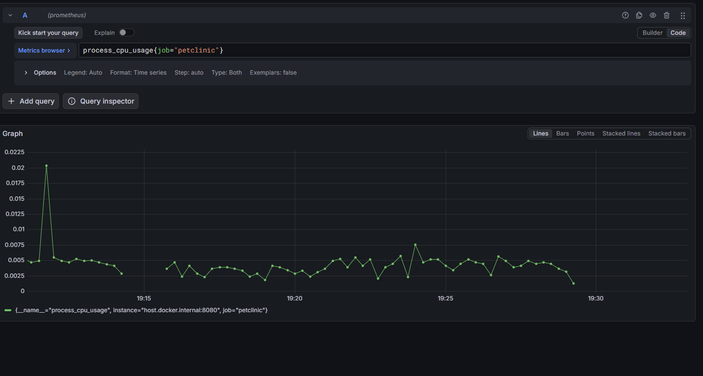
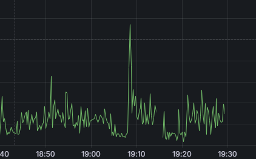
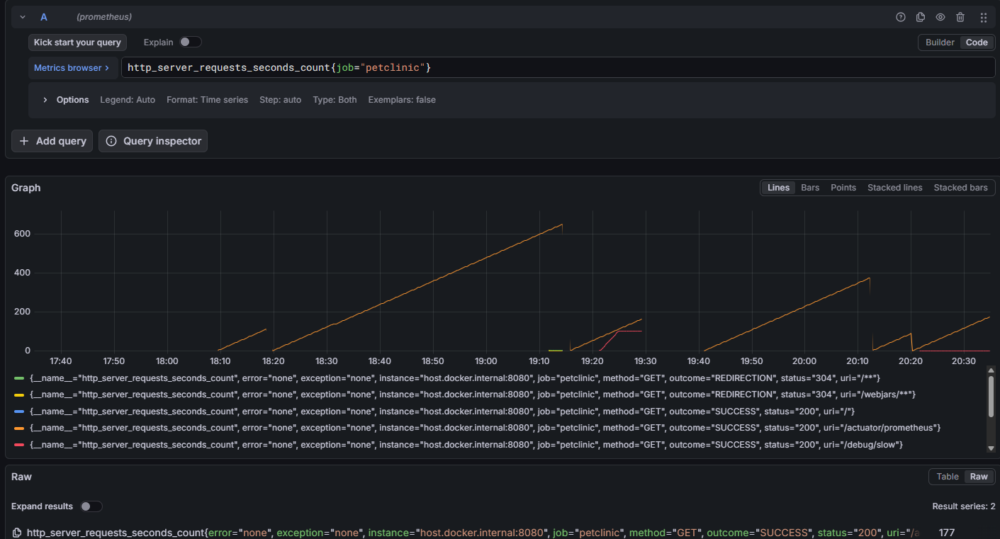
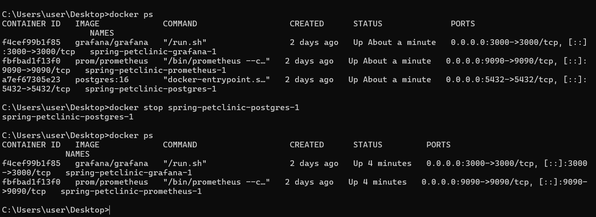
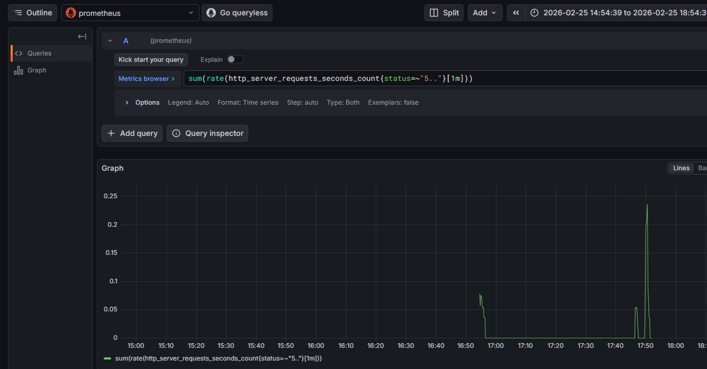
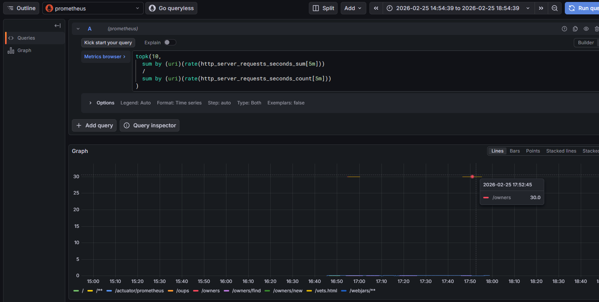
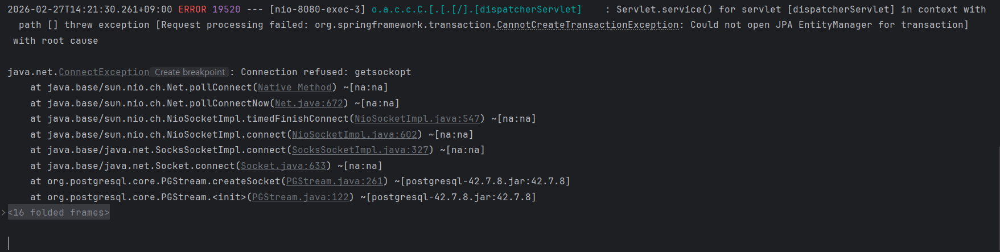
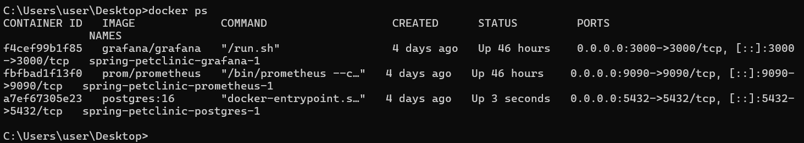
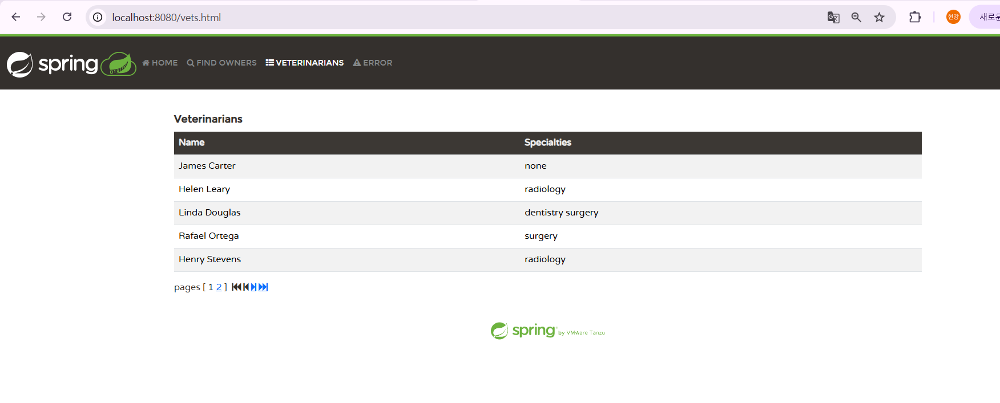

## 프로메테우스 그라파나 모니터링 연습

- 프로메테우스 매트릭 수집

- 그라파나로 수집한 매트릭 시각화

## 트러블 슈팅 1. 트래픽 증대

 - windows powerShell로 임의로 트래픽 증대

- 그라파나 Explore 쿼리로 확인 결과 19:20분경 트래픽과 지연시간이 증가된 것을 확인

## 생각해볼 수 있는것
 - cpu 문제
 - 특정 엔드포인트에서의 문제
 - DB 문제 시그널: DB 컨테이너 로그에서 대기/연결 문제가 보이거나, 특정 API에서만 지연이 커짐 
 - 앱 문제 시그널: CPU 상승, 스레드 증가, GC 증가 등 JVM 지표가 같이 흔들림

#### cpu 문제
process CPU vs system CPU
process CPU만 튐 → 내 앱(코드/GC) 쪽 가능성 ↑
system CPU도 같이 튐 → 다른 프로세스/호스트 리소스 문제 가능성 ↑

**CPU 튐과 함께 무엇이 같이 튀는가?**
응답시간(latency)↑ + RPS(요청량)↑ + CPU↑
→ 트래픽 과부하/스케일 문제 또는 핫패스 비효율

응답시간↑인데 CPU는 낮음
→ DB/네트워크 대기(= I/O 바운드) 가능성 ↑

GC pause↑ + CPU↑ + 힙 사용↑
→ 객체 과다 생성/메모리 압박/GC 문제 가능성 ↑

#### cpu 체크

process cpu 체크 19:20분경 이상 없음

system cpu 체크 19:20분경 이상 없음

결과: cpu 문제 말고 다른 문제 파악을 해야함
#### 특정 엔드포인트 체크

- 파악 하기 전 엔드 포인트 라벨 확인

- 특정 엔드포인트에서 많은 요청이 일어나는 것을 확인

- 이것을 바탕으로 엔드포인트 쿼리를 보내 19:20분에 이상있는지 파악
- 이상이 있다는 것을 확인 후 코드 확인

- 코드확인 결과 Thread.sleep(2000);때문에 지연이 일어난 것을 확인
- Thread.sleep(2000); 메서드 제거 
- 1차 트러블 슈팅 종료

---
## 트러블 슈팅 2. 데이터베이스 off

- 임의로 데이터베이스 OFF

- VETERINARIANS 탭으로 들어가서 데이터 베이스 접속
- 데이터 베이스 접속이 안되어 Error 탭으로 가는것을 확인

#### Grafana info확인

 - 쿼리 status를 500대로 확인 해봤을때 17:50 분경 그래프가 튀는 것을 확인

- 특정 url에서 그래프가 튀는 것을 확인

- 앱로그 확인 문제 발견( Could not open JPA EntityManager for transaction)

- 현재 docker에 올라와 있는 컨테이너 확인해 본 결과 postgresql이 올라와 있지 않다는 것을 확인

- postgresql을 컨테이너로 올린후 문제 재확인

- 정상적으로 해당 url에 들어가지는 것을 확인
- 2차 트러블 슈팅 종료

---
